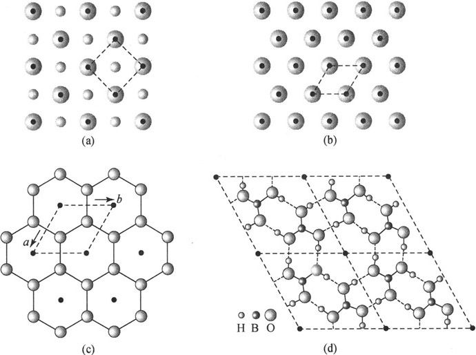
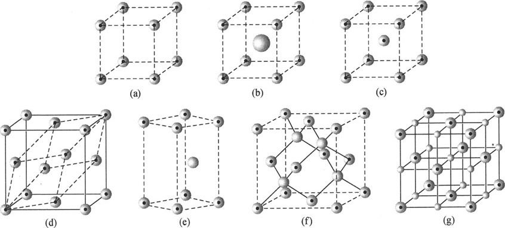
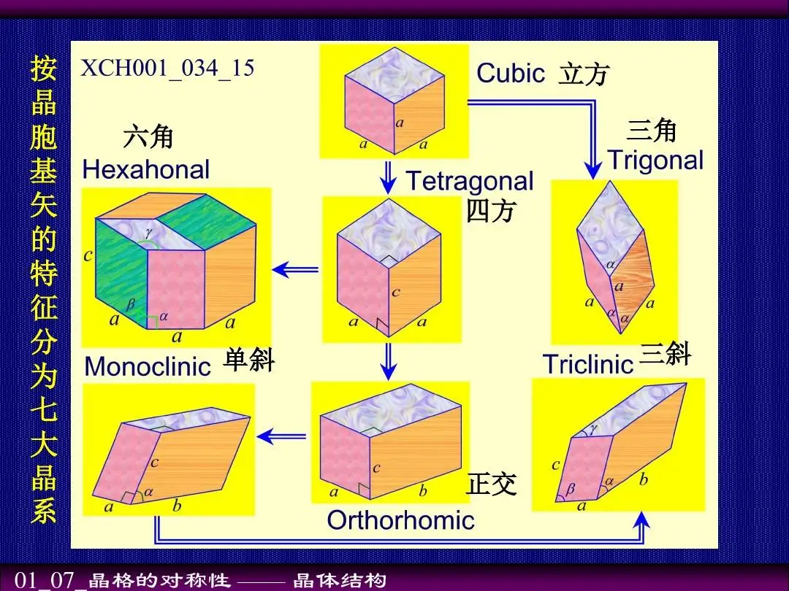
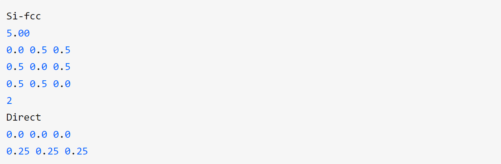
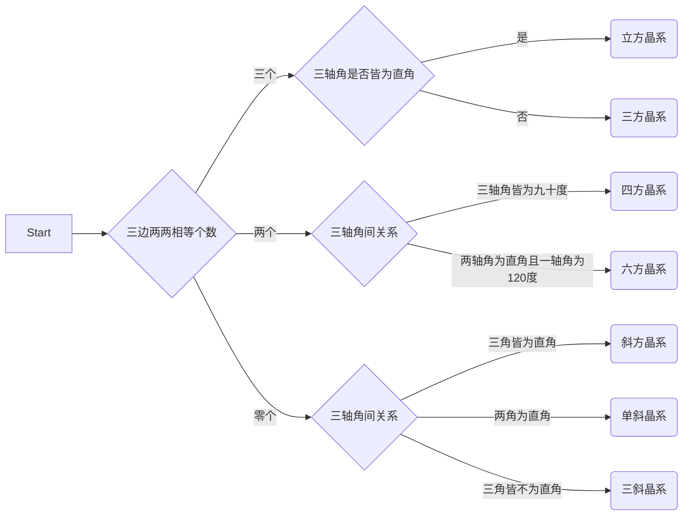

# 识别布拉菲格子类型的python程序

## 一、基础知识
### 1.1 晶体结构
==**晶体结构 = 空间点阵 + 结构基元**==
>Crystal structure， the manner in which atoms, ions, or molecules are spatially arranged.
1. 空间点阵
    - 空间点阵是晶体中结构基元排列的几何学抽象，用以描述和分析晶体结构的周期性和对称性
   - 由于各点阵的周围环境相同，故只有十四种空间点阵
  
2. 结构基元
   - 点阵结构中每个点阵所代表的具体内容，即包括原子或分子的种类、数量及其在空间按照一定方式的结构单元，称为晶体的结构基元

3. 晶格
   - 晶格是对晶体结构的几何抽象，晶格可用于表示晶体结构，表示原子位置的三位排序
  
  *由此我们可以看到，选定的结构基元必须能够只通过平移来复原整个晶体结构:*
  
</img>
$\qquad \qquad\qquad\qquad$二维的结构基元
</img>
$\qquad \qquad\qquad\qquad$三维的结构基元

### 1.2 晶格的周期性
==**晶格的周期性由原胞和基矢来描述**==
1. 原胞——晶格中最小重复单元
   - 三维晶格的重复单元是平行六面体
2. 基矢——原胞的边矢量
   - 重复单元的边长矢量$\vec{a}, \vec{b}, \vec{c}$

### 1.3 晶胞
- 晶胞是晶体结构的基本重复单位，整个晶体就是按晶胞在三维空间周期地重复排列，相互平行取向，按每一顶点为8个晶胞共有的方式堆砌而成。
- 晶胞包含了描述一个晶体结构，包括组成、对称性和空间排列的特点等所有信息。
- 我们不仅能够通过晶胞了解结构基元（化学组成），还能够通过晶胞来推出点阵（结构周期重复的方式），进一步地还能了解晶体的宏观对称性。

### 1.4 原胞
- 在完整晶体中，晶格在空间的三个方向上都具有一定的周期对称性，这样可以取一个以结点为顶点，边长等于这三个方向上的周期的平行六面体作为最小的重复单元，来概括晶格的特征，这样的重复单元称为初基原胞或简称原胞。
- ==与晶胞的区别==
  - 晶胞：就是可以复制出整个晶体的一小部分晶体
  - 原胞：可以通过重复形成晶格的最小晶胞

## 二、 布拉伐晶格(Bravais lattice)
>布拉伐晶格是三维空间中由一个或多个原子所组成的基底所形成的无限点阵，每个晶格点上都能找到这样同样的基底，或者说定向移动整数倍到另一个点时也能找到同样的基底，因此晶格在任何一个晶格点上看起来都完全一样。三维布拉维晶格只有14种可能。       ——维基百科

==**布拉伐晶格指的是晶体的空间点阵形式**==

### 2.1 晶系
- 晶体按其几何形态的对称程度可分为不同晶系
- 一共可分为七类，即等轴晶系、六方晶系、四方晶系、三方晶系、斜方晶系、单斜晶系和三斜晶系。
- 
- 这七个晶系又可分为三个晶族。
  - 等轴晶系因对称程度最高。属于高级晶族
  - 六方、四方、三方晶系对称程度中等．属中级晶族
  - 斜方、单斜、三斜晶系对称程度最低，属于低级晶族

### 2.2 布拉伐晶格
14种布拉维晶格可分成7种晶系，每种晶系又可依中心原子在晶胞中的位置不同再分成6种晶格：
- 简单（P）：晶格点只在晶格的八个顶点处
- 体心（I）：除八个顶点处有晶格点外，晶胞中心还有一个晶格点
- 面心（F）：除八个顶点处有晶格点外，在六个面的中央还有一个晶格点
- 底心（A，B或C）：除八个顶点处有晶格点外，在晶胞的一组平行面（A，B或C）的每个面中央还有一个晶格点

*7种不同晶系与每种晶系的6种不同晶格共有7 × 6 = 42种组合，但是有些组合其实是相同的，都能组成14种布拉维晶格*


## 三、模型建立

### 3.1 POSCAR格式
>POSCAR文件描述了所计算体系的晶胞参数，原子个数以及晶胞中原子位置

</img>
1. 第一行：体系的名称
2. 第二行：基矢的缩放系数，可认为晶格常数
3. 第三行至第五行：基矢，对应实空间直角坐标系
4. 第六行：原胞中原子的个数
5. 第七行：说明原子的坐标是相对基矢给出的
6. 第八行至第九行：各原子的位置

### 3.2 判断晶系类型


实现代码：
```python
import linecache
import numpy as np
import math


# 求向量模长，即晶胞轴长
def vec_len(vec):
    return np.linalg.norm(vec)


# 求两向量间夹角，即晶胞轴角
def vec_angle(v1, v2):
    l1 = np.linalg.norm(v1)
    l2 = np.linalg.norm(v2)
    cos_angle = np.dot(v1, v2) / (l1 * l2)

    angle = np.arccos(cos_angle)

    return angle / math.pi


file_name = "./POSCAR"

# 打开POSCAR文件
file = open("./POSCAR")
# 读取POSCAR文件
# constant_list为A,B,C晶格参数
constant_list = []
# 创建3*3的二维数组用于存储基矢信息
constant_array = np.zeros([3, 3])
for i in [3, 4, 5]:
    constant_number = linecache.getline(file_name, i).split()
    constant = 0
    for j in range(3):
        constant = constant + float(constant_number[j]) ** 2
        constant_array[i - 3, j] = float(constant_number[j])
    constant_list.append(round(constant ** 0.5, 5))

# 先判断constant_list中有几个元素相等
len_counter = 0
if round(vec_len(constant_array[0]), 5) == round(vec_len(constant_array[1]), 5):
    len_counter += 1

if round(vec_len(constant_array[1]), 5) == round(vec_len(constant_array[2]), 5):
    len_counter += 1

if round(vec_len(constant_array[0]), 5) == round(vec_len(constant_array[2]), 5):
    len_counter += 1

# 再判断三轴角中有几个等于90°
angle_counter = 0
if vec_angle(constant_array[0], constant_array[1]) == 0.5:
    angle_counter += 1

if vec_angle(constant_array[0], constant_array[2]) == 0.5:
    angle_counter += 1

if vec_angle(constant_array[1], constant_array[2]) == 0.5:
    angle_counter += 1

# 统计完毕，开始分类
# 三边相等
if len_counter == 3:
    if angle_counter == 3:
        print("立方晶系")
    else:
        print("三方晶系")
# 两边相等
elif len_counter == 2:
    if angle_counter == 3:
        print("四方晶系")
    else:
        print("六方晶系")
# 无相等边
else:
    if angle_counter == 3:
        print("斜方晶体")
    elif angle_counter == 0:
        print("三斜晶系")
    else:
        print("单斜晶系")

```


## 四、阅读一平师兄的代码

- map函数

传入一个函数和一个可迭代变量，map函数会对可迭代变量一一进行函数操作

- getline函数
``` python
import linecache
# 读取POSCAR函数中的一行，以字符串列表的形式返回
constant_number = linecache.getline(FileName, i).split()
```

五、总结
1. 代码基本实现了判断晶格的晶系种类
2. 在老师和一平师兄的讲解下逐渐明白了对晶体结构的描述

## 五、识别出ibrav参数

### 每种ibrav的边角关系

1. ibrav = 1（简单立方）

三边相等，且三条边两两垂直
2. ibrav = 2（立方面心）

三边相等，且三条边两两夹角为60°
3. ibrav = 3（立方体心）

三边相等，且两两夹角的cos值分别为1/3，1/3和-1/3

4. ibrav = -3

三边相等，且两两夹角的cos值都为-1/3

5. ibrav = 4（六方晶系）

两边相等，且两两夹角的cos值为0，0和-1/2

6. ibrav = 5（三方晶系）

三边相等，且两两的夹角的cos值都为不为0的任意值，v1中的第一个参数与v2中的第二个参数不相等

7. ibrav = -5

三边相等，且两两的夹角的cos值都为不为0的任意值，v1中的第一个参数与v2中的第二个参数相等

8. ibrav = 6（简单四方晶系）

两边相等，且三条边两两垂直

9. ibrav = 7（四方体心）

三边相等，且三边的两两夹角中有两个相等

10. ibrav = 8（简单正交）

三边皆不相等，且两两垂直

11. ibrav = 9（底心正交）

三边皆不相等，且两两夹角的cos值为0，0和任意,v1中的第二个参数为正

12. ibrav = -9

三边皆不相等，且两两夹角的cos值为0，0和任意，v1中的第二个参数为负

13. ibrav = 91

三边皆不相等，且两两夹角的cos值为0，0和任意，v1中的第二个参数为零

14. ibrav = 10（面心正交）

三边皆不相等，且两两夹角皆不相等

15. ibrav = 11（体心正交）

三边相等，且两两夹角皆不相等

16. ibrav = 12（单斜晶系）

三边皆不相等，且两两夹角的cos值为0，任意和另一任意，v3中的第一个参数为零

17. ibrav = -12（单斜晶系）

三边皆不相等，且两两夹角的cos值为0，任意和另一任意，v3中的第一个参数不为零

18. ibrav = 13（单斜底心）

两边相等，且两两夹角的cos值为任意两个不为0的相等值和一个不为零的值，v1中的第三个参数不为零

19. ibrav = -13（单斜底心）

两边相等，且两两夹角的cos值为任意两个不为0的相等值和一个不为零的值，v1中的第三个参数为零

20. ibrav = 14（三斜晶系）

三边皆不相等，两两夹角的cos值也皆不为零且不相等
